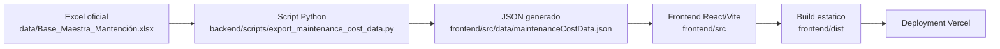
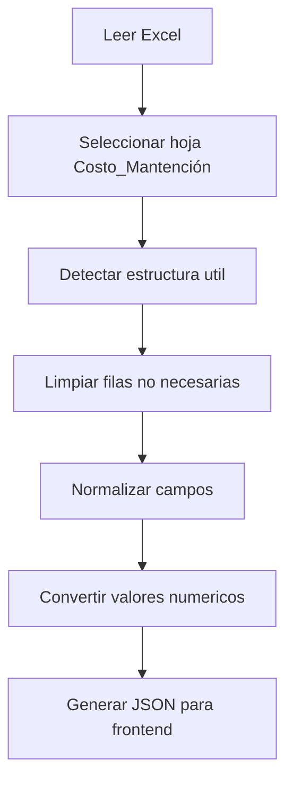
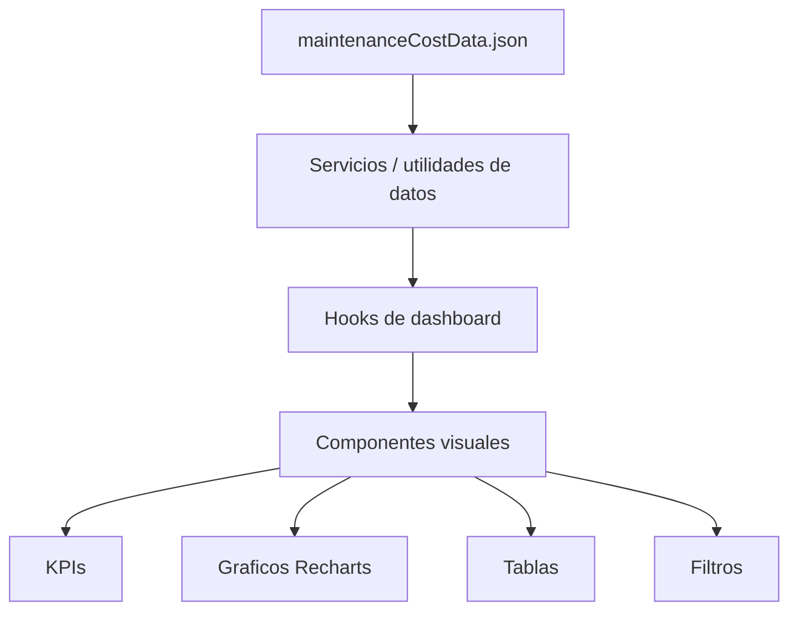

# Data Flow - Pullman Control Mantencion

## 1. Proposito

Este documento describe el flujo oficial de datos del sistema Pullman Control Mantencion, desde la fuente Excel corporativa hasta su visualizacion en el dashboard web React.

El objetivo es dejar trazabilidad operativa y tecnica suficiente para que un desarrollador, analista o auditor pueda entender como se generan, transforman, publican y consumen los datos del sistema.

## 2. Alcance

Este documento cubre:

- Origen oficial de datos.
- Transformacion mediante Python.
- Exportacion a JSON.
- Consumo por el frontend React.
- Dependencias tecnicas.
- Riesgos operativos.
- Puntos criticos de control.

Este documento no cubre:

- Cambios funcionales del dashboard.
- Autenticacion real.
- Automatizaciones futuras no implementadas.
- Reemplazo del Excel por base de datos.

## 3. Flujo General De Datos

El flujo oficial vigente es:

```text
Excel corporativo -> Script Python -> JSON generado -> Frontend React -> Deployment Vercel
```



## 4. Origen Oficial De Datos

La fuente oficial actual es el archivo:

```text
data/Base_Maestra_Mantención.xlsx
```

La hoja esperada es:

```text
Costo_Mantención
```

Este archivo representa la fuente de verdad operativa del sistema. El dashboard no debe modificarlo, sobrescribirlo ni actuar como editor del Excel.

| Elemento | Descripcion |
|---|---|
| Archivo fuente | `data/Base_Maestra_Mantención.xlsx` |
| Tipo | Excel corporativo |
| Uso | Fuente primaria de datos de mantencion |
| Modificacion por la app | No permitida |
| Responsable esperado | Area operativa o responsable de datos |

## 5. Transformacion De Datos

La transformacion se realiza mediante el script:

```text
backend/scripts/export_maintenance_cost_data.py
```

Responsabilidades del script:

- Leer el archivo Excel fuente.
- Identificar la hoja de datos operativa.
- Normalizar la estructura necesaria para el dashboard.
- Limpiar filas no operativas cuando corresponda.
- Convertir valores numericos a formatos utilizables por React.
- Exportar un archivo JSON estatico.



## 6. Exportacion A JSON

El resultado generado por el script es:

```text
frontend/src/data/maintenanceCostData.json
```

Este archivo es consumido directamente por React. Aunque vive dentro del frontend, debe entenderse como un artefacto generado, no como una fuente editable manualmente.

| Archivo | Tipo | Politica |
|---|---|---|
| `data/Base_Maestra_Mantención.xlsx` | Fuente de verdad | No modificar desde la app |
| `backend/scripts/export_maintenance_cost_data.py` | Transformador | Modificar solo con aprobacion tecnica |
| `frontend/src/data/maintenanceCostData.json` | Artefacto generado | No editar manualmente |

## 7. Consumo Frontend

El frontend React consume el JSON como dataset estatico. La aplicacion no lee Excel directamente y no ejecuta Python en runtime.

Responsabilidades del frontend:

- Cargar el JSON generado.
- Aplicar logica de agregacion, filtros y calculos visuales.
- Renderizar KPIs, rankings, graficos y tablas.
- Presentar la informacion en una interfaz BI ejecutiva.



## 8. Dependencias Tecnicas

| Capa | Dependencias |
|---|---|
| Datos | Excel corporativo `.xlsx` |
| Procesamiento | Python, Pandas, Openpyxl |
| Artefacto frontend | JSON |
| Aplicacion web | React, Vite, Tailwind CSS, Recharts |
| Versionamiento | Git, GitHub |
| Deployment | Vercel |

## 9. Puntos Criticos De Control

| Punto critico | Riesgo | Control recomendado |
|---|---|---|
| Excel fuente | Cambios de estructura o nombres de columnas | Validar antes de ejecutar exportacion |
| Hoja esperada | Hoja ausente o renombrada | Confirmar existencia de `Costo_Mantención` |
| Script Python | Transformacion incorrecta | Revisar salida y errores del script |
| Multiples archivos `.xlsx` | El script podria procesar una fuente equivocada | Mantener solo el Excel oficial en `data/` durante la exportacion |
| Fallback de hoja | Si no se encuentra la hoja esperada, podria procesarse la primera hoja del workbook | Confirmar explicitamente la hoja `Costo_Mantención` antes de publicar |
| JSON generado | Edicion manual o datos incompletos | Regenerar siempre desde Python |
| Frontend | Visualizacion con datos desactualizados | Confirmar fecha y contenido del JSON |
| Deployment | Publicacion de datos incorrectos | Ejecutar checklist pre-deploy |

## 10. Riesgos Del Flujo

| Riesgo | Impacto | Mitigacion |
|---|---|---|
| Excel actualizado pero JSON no regenerado | Dashboard muestra informacion antigua | Ejecutar guia mensual de actualizacion |
| JSON editado manualmente | Perdida de trazabilidad | Prohibir edicion manual y revisar diff |
| Cambios estructurales en Excel | Script falla o genera datos incorrectos | Validacion previa de columnas y hoja |
| Multiples Excel en `data/` | El script puede seleccionar un `.xlsx` no oficial | Mantener controlada la carpeta `data/` |
| Hoja esperada ausente | El script podria usar una hoja alternativa | Validar nombre exacto de hoja antes de commit |
| Dependencias Python no instaladas | La exportacion falla antes de generar JSON | Instalar dependencias desde `requirements.txt` |
| Encoding/mojibake en Windows | Rutas o nombres con acentos pueden verse corruptos | Usar editor UTF-8 y verificar nombres reales en el filesystem |
| Datos personales en JSON | Exposicion si el sitio es publico | Revisar alcance de publicacion y seguridad |
| Login solo visual | No protege datos reales | No considerar la app segura por defecto |
| Build sin validacion visual | Deploy con errores de UI | Validar dashboard antes de publicar |

## 11. Reglas Oficiales De Actualizacion

1. El Excel oficial es la fuente primaria de datos.
2. El JSON no debe editarse manualmente.
3. Toda actualizacion de datos debe ejecutarse mediante el script Python.
4. Despues de generar el JSON, se debe validar el dashboard localmente.
5. Antes de publicar, se debe ejecutar build de produccion.
6. Todo cambio debe quedar trazable en Git.
7. No se debe publicar una actualizacion sin revisar riesgos de datos sensibles.

## 12. Supuestos Documentados

| Supuesto | Estado |
|---|---|
| La fuente oficial sigue siendo Excel | Vigente |
| La app oficial sigue siendo React/Vite dentro de `frontend/` | Vigente |
| El despliegue esperado es Vercel | Vigente |
| No existe backend persistente en produccion | Vigente |
| No existe autenticacion real implementada | Vigente |
