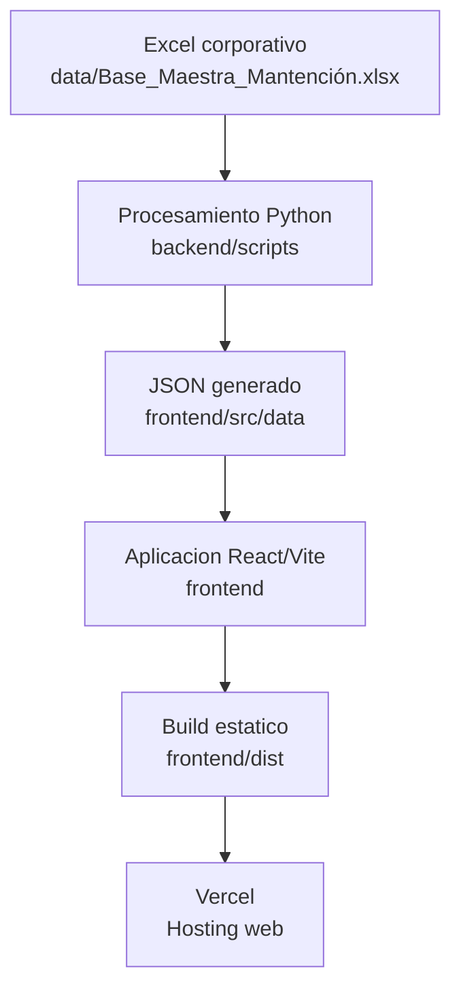
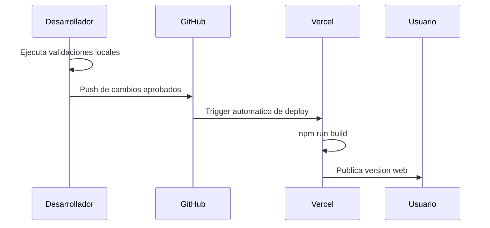

# System Architecture - Pullman Control Mantencion

## 1. Proposito

Este documento describe la arquitectura operativa actual de Pullman Control Mantencion. Su finalidad es entregar una vision clara del sistema para mantenimiento, auditoria tecnica, onboarding de futuros desarrolladores y planificacion de escalabilidad.

## 2. Vision General

Pullman Control Mantencion es una plataforma BI web orientada al analisis ejecutivo de costos de mantencion. La arquitectura actual es estatica en runtime: los datos se procesan previamente desde Excel mediante Python y luego se consumen como JSON desde una aplicacion React desplegable en Vercel.



## 3. Arquitectura Actual

| Capa | Tecnologia | Responsabilidad |
|---|---|---|
| Datos fuente | Excel | Mantener informacion oficial de costos |
| Procesamiento | Python, Pandas, Openpyxl | Transformar Excel a JSON |
| Datos frontend | JSON | Alimentar la aplicacion React |
| Frontend | React, Vite, Tailwind CSS, Recharts | Visualizar KPIs, filtros, graficos y tablas |
| Versionamiento | Git, GitHub | Controlar cambios y trazabilidad |
| Deployment | Vercel | Publicar build estatico |

## 4. Frontend

La version oficial del sistema vive en:

```text
frontend/
```

Responsabilidades principales:

- Presentar dashboard ejecutivo.
- Consumir datos desde `frontend/src/data/maintenanceCostData.json`.
- Renderizar indicadores clave.
- Permitir filtros y lectura segmentada de costos.
- Mostrar tablas, rankings y graficos.
- Mantener una experiencia visual corporativa tipo SaaS / BI.

Tecnologias:

- React.
- Vite.
- Tailwind CSS.
- Recharts.
- Lucide React.

## 5. Backend De Procesamiento

El proyecto no cuenta con un backend persistente ni una API en runtime. La carpeta `backend/` contiene actualmente scripts de procesamiento.

Script principal:

```text
backend/scripts/export_maintenance_cost_data.py
```

Responsabilidades:

- Leer Excel oficial.
- Procesar los datos necesarios.
- Generar JSON para el frontend.

Este backend ligero debe entenderse como una etapa de preparacion de datos, no como un servidor de aplicacion.


## 6. Datos

Los datos se organizan en tres categorias:

| Categoria | Archivo | Rol |
|---|---|---|
| Fuente oficial | `data/Base_Maestra_Mantención.xlsx` | Fuente primaria |
| Transformacion | `backend/scripts/export_maintenance_cost_data.py` | Proceso de conversion |
| Artefacto generado | `frontend/src/data/maintenanceCostData.json` | Entrada para React |

Reglas:

- El Excel no debe ser modificado por la app.
- El JSON no debe editarse manualmente.
- El JSON debe regenerarse usando el script Python.
- Los cambios de datos deben ser revisados antes de deploy.

## 7. Deployment

El despliegue esperado se realiza mediante Vercel conectado a GitHub.

Configuracion esperada:

| Parametro | Valor esperado |
|---|---|
| Root directory | `frontend` |
| Build command | `npm run build` |
| Output directory | `dist` |
| Variables de entorno | No requeridas actualmente |



## 8. Estructura De Carpetas Sugerida

```text
Costo_Mantención/
├── backend/
│   └── scripts/
│       └── export_maintenance_cost_data.py
├── data/
│   └── Base_Maestra_Mantención.xlsx
├── docs/
│   ├── architecture/
│   ├── audit/
│   ├── decisions/
│   ├── deployment/
│   ├── operations/
│   └── roadmap/
├── frontend/
│   ├── public/
│   ├── src/
│   │   ├── components/
│   │   ├── data/
│   │   ├── hooks/
│   │   ├── layouts/
│   │   ├── pages/
│   │   ├── services/
│   │   └── utils/
│   ├── package.json
│   ├── package-lock.json
│   └── vite.config.js
├── references/
├── AGENTS.md
├── HANDOFF.md
├── README.md
└── requirements.txt
```

## 9. Componentes Criticos

| Componente | Criticidad | Motivo |
|---|---:|---|
| Excel fuente | Alta | Contiene los datos oficiales |
| Script Python | Alta | Genera el dataset consumido por React |
| JSON generado | Alta | Alimenta el dashboard |
| Frontend React | Alta | Es la interfaz oficial |
| Vercel | Media/Alta | Publica el sistema |
| GitHub | Alta | Mantiene trazabilidad y despliegue |
| Documentacion operativa | Alta | Permite continuidad del proyecto |

## 10. Limites Actuales De La Arquitectura

| Limite | Descripcion |
|---|---|
| Sin backend runtime | No hay API ni servidor persistente |
| Sin base de datos | El Excel sigue siendo la fuente oficial |
| Sin autenticacion real | El login actual no debe considerarse seguridad efectiva |
| Datos estaticos | El dashboard refleja el ultimo JSON generado |
| Validaciones manuales | La operacion depende de checklists y revision humana |
| Seleccion de Excel por patron | Si hay multiples `.xlsx` en `data/`, el script podria usar una fuente equivocada |
| Dependencias locales | Python, Pandas y Openpyxl deben estar instalados para regenerar datos |
| Encoding en Windows | Rutas y nombres con acentos requieren cuidado para evitar mojibake |

## 11. Puntos De Escalabilidad Futura

Estos puntos no estan implementados actualmente y requieren aprobacion antes de ejecutarse.

| Area | Posible evolucion |
|---|---|
| Datos | Base de datos relacional o almacenamiento historico |
| Backend | API para carga, validacion y consulta de datos |
| Seguridad | Autenticacion real, roles y control de acceso |
| Auditoria | Registro de cargas, usuario responsable y fecha |
| Calidad de datos | Validaciones automaticas de schema y consistencia |
| Deployment | Ambientes separados: desarrollo, staging y produccion |
| CI/CD | Validacion automatica de build y calidad antes de deploy |

## 12. Principios Arquitectonicos Vigentes

1. React/Vite es la version oficial.
2. Streamlit fue retirado del repositorio principal.
3. Excel es la fuente oficial actual.
4. Python transforma datos, no actua como backend runtime.
5. JSON es un artefacto generado.
6. El dashboard debe mantener enfoque ejecutivo y corporativo.
7. Los cambios deben ser incrementales, revisables y reversibles.
8. No se debe introducir infraestructura nueva sin aprobacion.

## 13. Supuestos Documentados

| Supuesto | Estado |
|---|---|
| Vercel sera la plataforma de despliegue | Supuesto operativo vigente |
| GitHub sera el repositorio remoto principal | Supuesto operativo vigente |
| La actualizacion de datos sera mensual | Supuesto operativo de esta fase |
| La operacion sera ejecutada por una persona tecnica o analista entrenado | Supuesto operativo |
