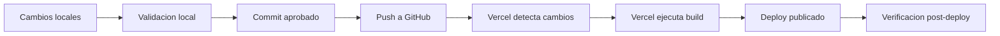

# Vercel Deployment - Pullman Control Mantencion

## 1. Proposito

Este documento define el flujo de despliegue esperado para Pullman Control Mantencion usando GitHub y Vercel.

Su objetivo es asegurar que cada publicacion sea trazable, validada y reversible.

## 2. Alcance

Este documento cubre:

- Flujo GitHub -> Vercel.
- Configuracion esperada.
- Validaciones previas.
- Verificacion post-deploy.
- Rollback.
- Riesgos comunes.

No cubre:

- Implementacion de autenticacion real.
- Cambios de infraestructura no aprobados.
- Ambientes separados no existentes actualmente.

## 3. Flujo Actual De Despliegue



## 4. Configuracion Esperada En Vercel

| Parametro | Valor |
|---|---|
| Framework | Vite |
| Root directory | `frontend` |
| Build command | `npm run build` |
| Output directory | `dist` |
| Install command | `npm install` |
| Variables de entorno | No requeridas actualmente |

Supuestos operativos:

- El flujo descrito asume integracion GitHub -> Vercel.
- No se debe asumir que existe `vercel.json` si no esta presente en el repositorio.
- La configuracion principal de build/deploy puede vivir en el panel de Vercel.
- Si se agrega `vercel.json` en el futuro, debe documentarse como cambio de configuracion.

## 5. Requisitos Previos Antes De Deploy

Antes de publicar:

1. Ejecutar build local.
2. Revisar dashboard localmente.
3. Revisar estado de Git.
4. Confirmar que solo hay cambios esperados.
5. Confirmar que no se publican datos sensibles sin aprobacion.
6. Confirmar que el login actual no se considera seguridad real.
7. Confirmar que existe estrategia de rollback.

Comandos recomendados:

```bash
git status --short --branch
```

```bash
cd frontend
npm.cmd run build
```

## 6. Buenas Practicas

| Practica | Motivo |
|---|---|
| Commits pequenos | Facilitan revision y rollback |
| Revisar diff antes de push | Evita publicar cambios accidentales |
| No versionar `dist/` | Vercel debe construir el build |
| No versionar `node_modules/` | Dependencias se instalan desde lockfile |
| Validar JSON antes de deploy | Evita publicar datos corruptos |
| Revisar datos personales | Reduce riesgo de exposicion |
| Mantener documentacion actualizada | Facilita auditoria futura |

## 7. Verificacion Post-Deploy

Despues de que Vercel publique:

| Validacion | Resultado esperado |
|---|---|
| Sitio abre | URL responde correctamente |
| Login visual | Pantalla inicial carga |
| Dashboard | Carga despues del acceso |
| KPIs | Valores visibles y razonables |
| Graficos | Renderizan correctamente |
| Filtros | Funcionan |
| Tabla | Muestra registros |
| Consola navegador | Sin errores criticos |

## 8. Rollback

### Rollback Desde Vercel

Si una publicacion falla visual o funcionalmente:

1. Entrar al panel del proyecto en Vercel.
2. Revisar historial de deployments.
3. Seleccionar el deployment estable anterior.
4. Promoverlo como version activa si corresponde.
5. Documentar motivo del rollback.

### Rollback Desde Git

Si el problema esta en un commit:

```bash
git revert <sha-del-commit>
```

Luego validar localmente y publicar nuevamente mediante el flujo normal.

Regla:

- Preferir `git revert` sobre reescritura de historial cuando el commit ya fue compartido.

## 9. Riesgos Comunes

| Riesgo | Impacto | Mitigacion |
|---|---|---|
| Deploy con datos sensibles | Exposicion de informacion | Revisar JSON y alcance publico |
| Login visual interpretado como seguridad | Falsa sensacion de proteccion | Documentar limitacion y controlar acceso externo |
| Build falla en Vercel pero no local | Diferencias de entorno | Revisar logs de Vercel y dependencias |
| Configuracion incorrecta de root | Vercel no encuentra app | Confirmar root `frontend` |
| Output directory incorrecto | Deploy sin archivos | Confirmar `dist` |
| Se asume `vercel.json` inexistente | Configuracion esperada no coincide con el repo | Revisar panel de Vercel y documentar cambios |
| Push de cambios no revisados | Publicacion accidental | Usar checklist pre-deploy |

## 10. Criterio De Deploy Exitoso

Un deploy se considera exitoso cuando:

- Vercel completa el build sin errores.
- La URL publicada responde.
- El dashboard carga correctamente.
- Los datos visibles corresponden a la version esperada.
- No hay errores criticos en consola.
- El commit desplegado esta identificado.
- Existe posibilidad clara de rollback.
